# WordPress Deployment using LAMP Stack on Amazon Linux

This guide explains how to **deploy WordPress** on an **Amazon Linux EC2 instance** using the **LAMP stack** (Linux, Apache, MariaDB, PHP).

---

## ➤ Prerequisites
- Amazon Linux EC2 instance
- Security group with ports **22 (SSH)** and **80 (HTTP)** open
- Basic Linux command knowledge
- Public IP of the EC2 instance

---

## ➤ Steps to Deploy

### Step 1: Update System & Install LAMP
Update your system and install **Apache**, **MariaDB**, and **PHP**:

```
sudo yum update
sudo yum install httpd mariadb105-server php -y
```
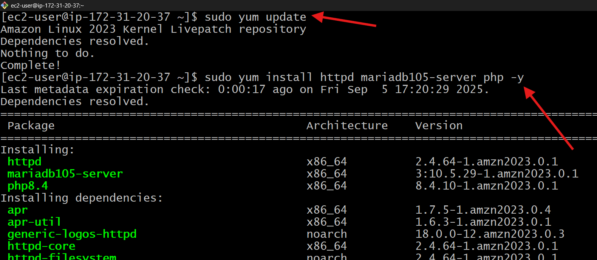

Start and enable the services:
```
sudo systemctl start httpd mariadb php-fpm
sudo systemctl enable httpd mariadb php-fpm
```
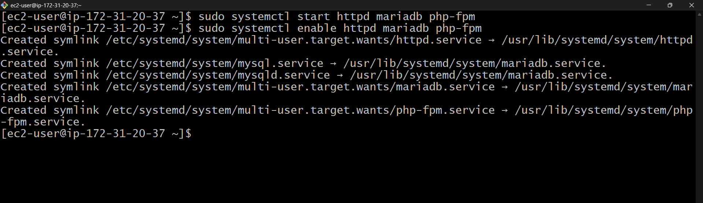

---

### Step 2: Install PHP MySQL Connector
Install the PHP MySQL connector so WordPress can connect to MariaDB:
```
sudo yum install php8.4-mysqlnd.x86_64 -y
```
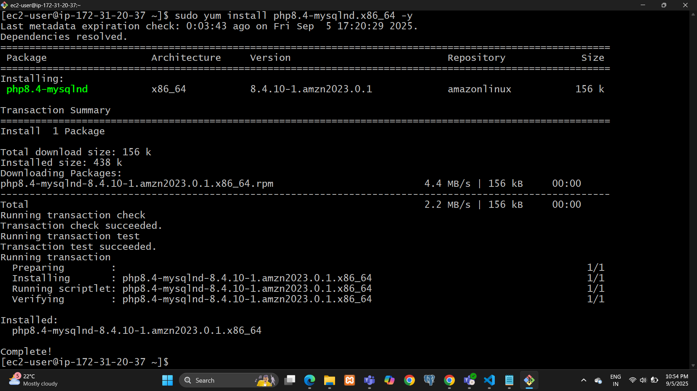

---

### Step 3: Download & Extract WordPress
Navigate to the web directory:
```
cd /var/www/html
```

Download WordPress:
```
sudo wget https://wordpress.org/latest.tar.gz
```

Extract the WordPress package:
```
sudo tar -xvzf latest.tar.gz
```
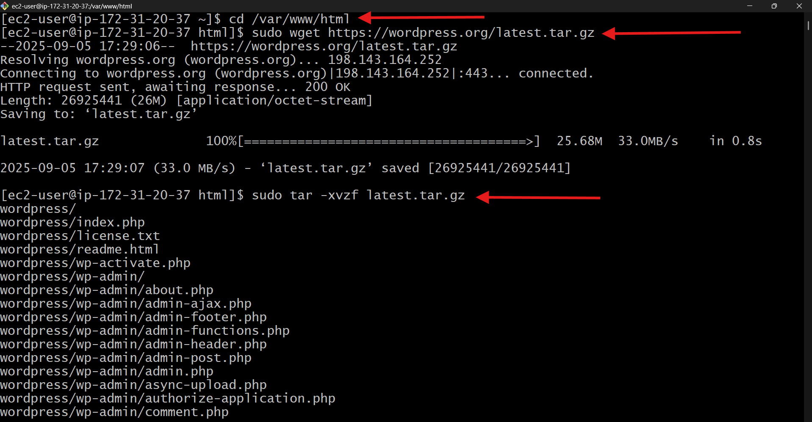

---

### Step 4: Verify Apache
Open your browser and visit:
```
http://<PUBLIC_IP>/wordpress
```

Replace `<PUBLIC_IP>` with your EC2 instance's public IP.
You should see the **WordPress setup screen**.

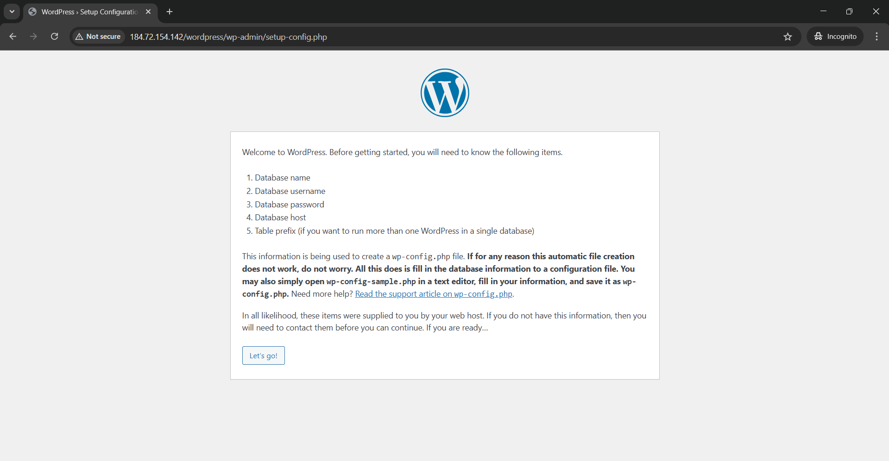

---

### Step 5: Create MySQL Database
Login to MySQL:
```
mysql -u root -p
```

Create a database for WordPress:
```
CREATE DATABASE wordpressdb;
```

Verify the database was created:
```
SHOW DATABASES;
```

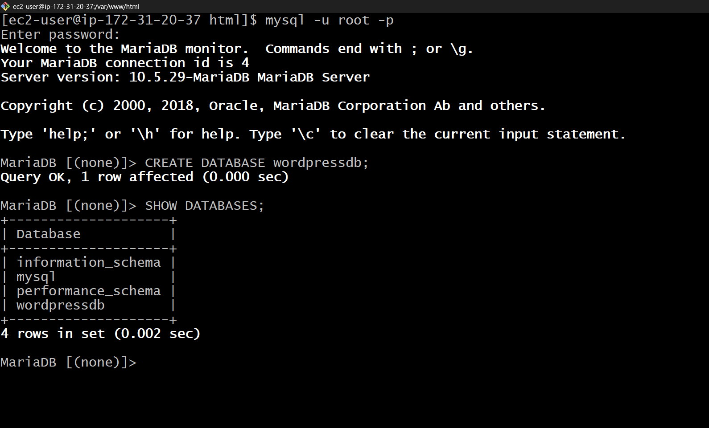

---

### Step 6: Configure WordPress Database
- On the WordPress setup screen, fill out the following details:

| Field          | Value         |
|----------------|--------------|
| Database Name  | wordpressdb  |
| Username       | root         |
| Password       | root         |
| Database Host  | localhost    |

- Click **Submit**.

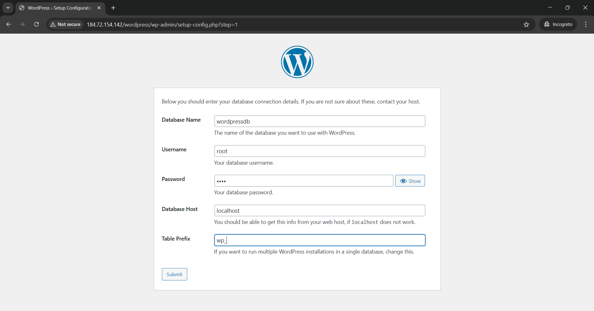

---

### Step 7: Set Permissions
Grant permissions to the WordPress files:
- This allows Apache to manage WordPress files, upload media, and install themes
```
sudo chown -R apache:apache wordpress
```
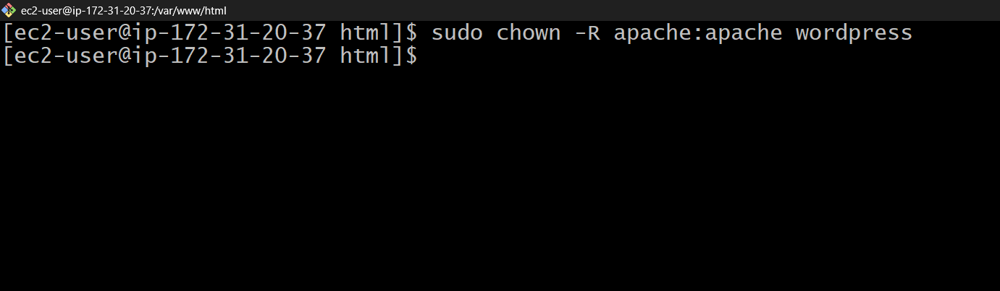

---

### Step 8: Finalize Installation
- Enter the following details on the setup page:

| Field       | Value       |
|-------------|------------|
| Site Title  | TechBlog   |
| Username    | root       |
| Password    | root       |
| Email       | abc@gmail.com|

- Click **Install WordPress** to finish the setup.

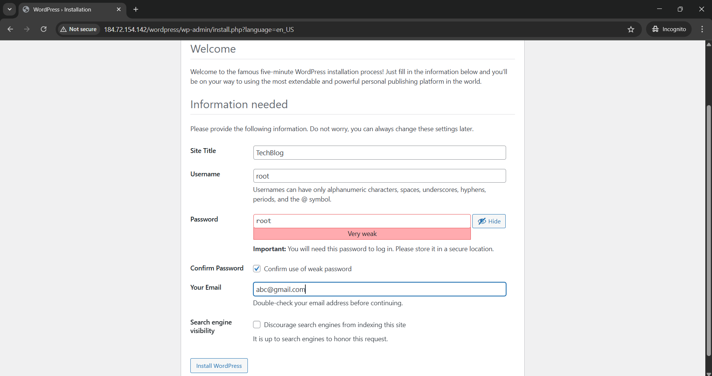
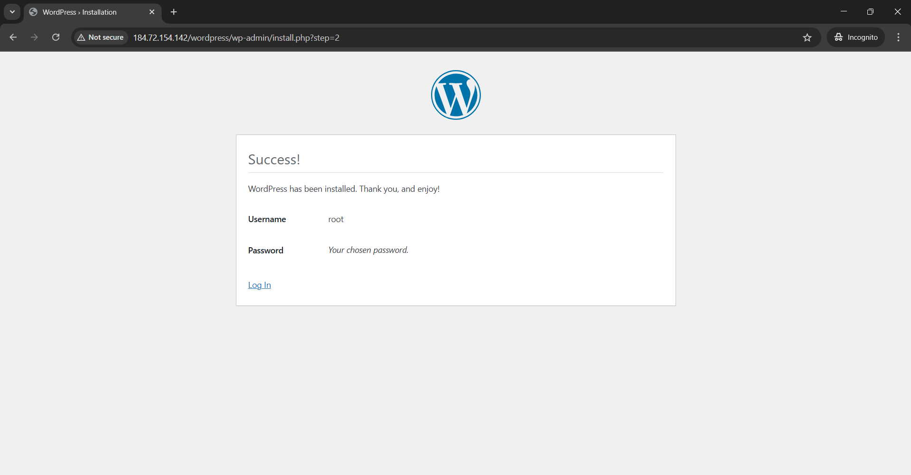

---

### Step 9: Verify WordPress Tables
Log in to MySQL and check tables:
```
mysql -u root -p
USE wordpressdb;
SHOW TABLES;
```
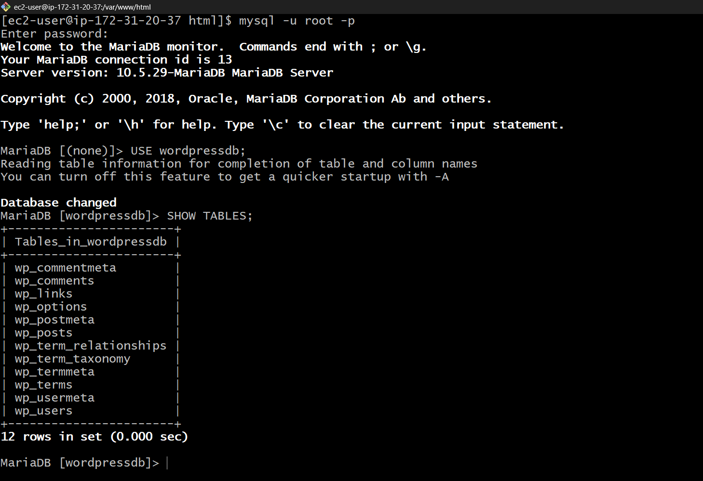

---

### Step 10: Log In to WordPress
Access the WordPress admin dashboard:
Go to:
```
http://<PUBLIC_IP>/wordpress/wp-admin
```

Login credentials:
- **Username:** root  
- **Password:** root

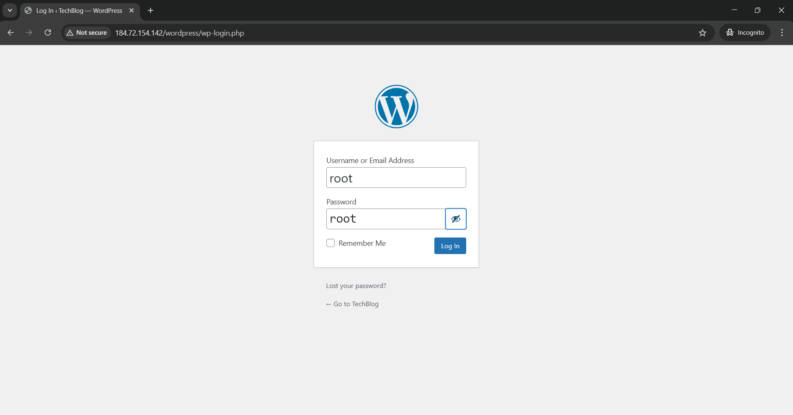

---

## After Login, you can see that you've successfully deployed wordpress application
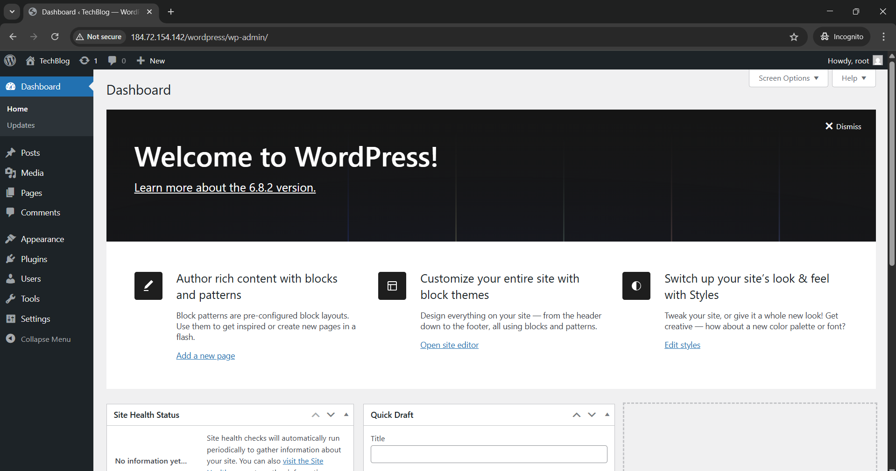

---
### Step 11: Create a Blog Post for testing 
- Go to **Posts → Add New**.
- Write and publish your first blog post.

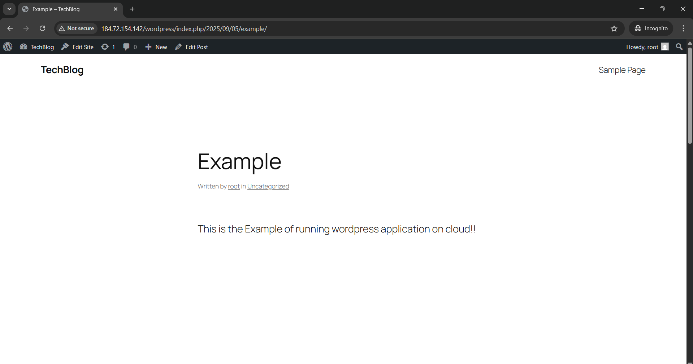

---

##  ➤ Summary
In this guide, we successfully deployed WordPress on an Amazon Linux EC2 instance using the LAMP stack. Starting with the installation and configuration of Apache, MariaDB, and PHP, we then set up WordPress by creating a dedicated database, configuring it, and assigning proper permissions. Finally, we accessed the WordPress admin dashboard and published our first blog post, confirming that everything was working smoothly. This setup provides a strong foundation for building and managing dynamic websites.

---

